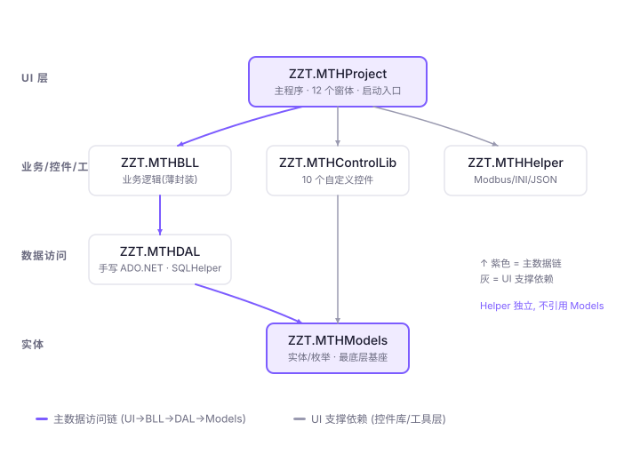
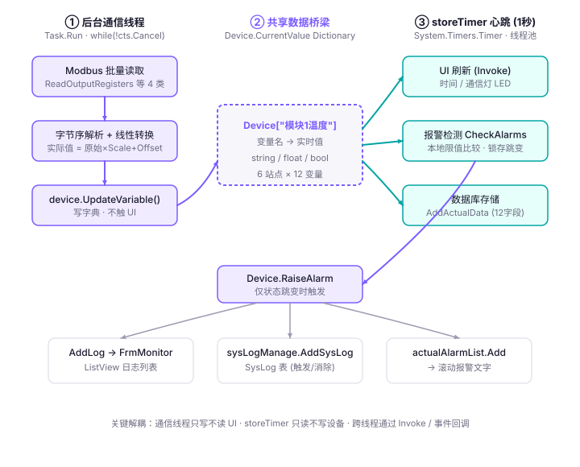
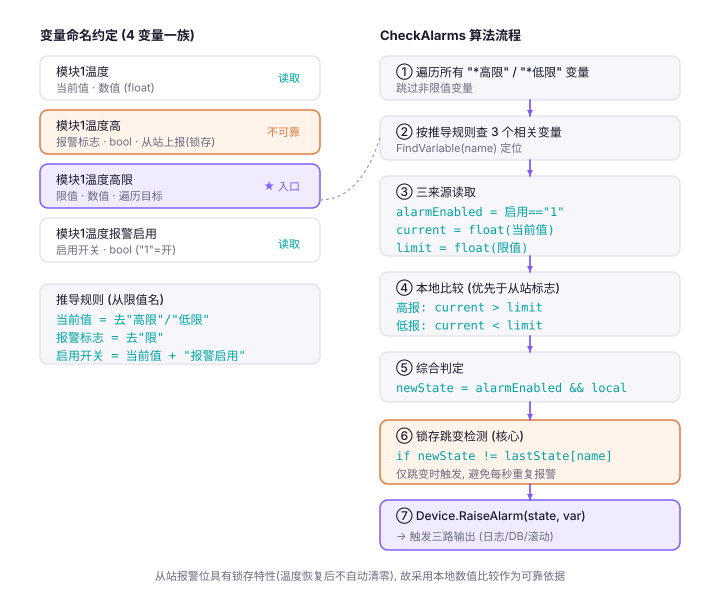
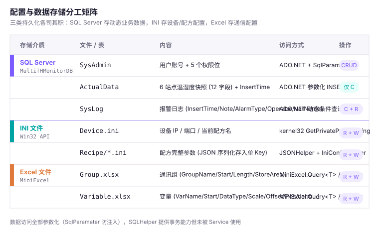
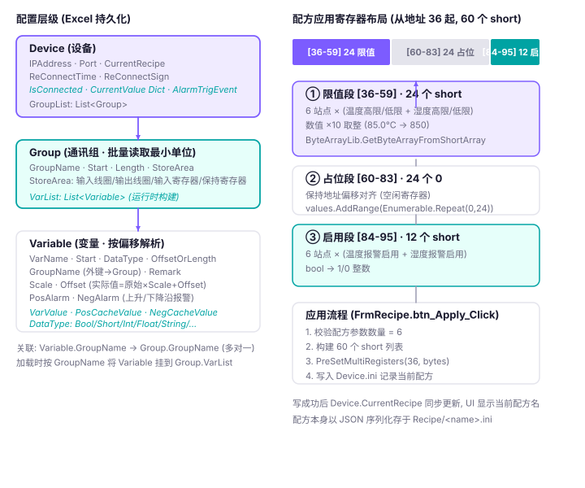
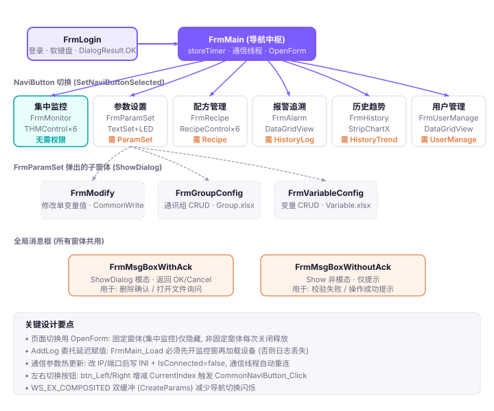

# ZZT.MTHProject 项目深度剖析文档

> 基于 .NET Framework 4.7.2 WinForms 的 Modbus TCP 多通道温湿度集中监控系统
> （MTH = Temperature & Humidity）

---

## 目录

- [一、项目概述](#一项目概述)
- [二、分层架构与项目依赖](#二分层架构与项目依赖) `含架构图`
- [三、数据层（Models / DAL / BLL）](#三数据层models--dal--bll)
- [四、工具层（ZZT.MTHHelper）](#四工具层zztmthhelper)
- [五、自定义控件库（ZZT.MTHControlLib）](#五自定义控件库zztmthcontrollib)
- [六、主项目入口与 FrmMain 核心逻辑](#六主项目入口与-frmmain-核心逻辑)
- [七、业务窗体集合](#七业务窗体集合)
- [八、核心数据流闭环](#八核心数据流闭环) `含数据流图`
- [九、报警检测机制](#九报警检测机制) `含报警机制图`
- [十、配置与存储分工](#十配置与存储分工) `含存储分工矩阵图`
- [十一、设备层级与配方布局](#十一设备层级与配方布局) `含设备层级与配方布局图`
- [十二、窗体导航与控件使用场景](#十二窗体导航与控件使用场景) `含导航关系图`
- [十三、设计亮点与改进点](#十三设计亮点与改进点)
- [十四、学习路径建议](#十四学习路径建议)

> **图表清单**：本文档包含 6 张 SVG 矢量图，位于 `docs/images/` 目录，可用浏览器或支持 SVG 的 Markdown 编辑器查看。

---

## 一、项目概述

### 1.1 系统定位

ZZT.MTHProject 是一套工业级温湿度集中监控上位机系统，通过 **Modbus TCP 协议**采集 6 个监测站点的温湿度数据，提供实时展示、历史趋势追溯、报警管理、配方下发等完整功能。

### 1.2 技术栈

| 维度 | 选型 |
|------|------|
| 框架 | .NET Framework 4.7.2 |
| UI | WinForms |
| 通信 | Modbus TCP（自实现，基于 System.Net.Sockets.Socket） |
| 数据库 | SQL Server（MultiTHMonitorDB） |
| 数据访问 | 手写 ADO.NET（SqlClient + SqlParameter） |
| 配置持久化 | INI（Win32 API）+ Excel（MiniExcel） |
| JSON | Newtonsoft.Json 13.0.0.0 |
| 第三方控件 | SeeSharpTools.JY.GUI（LED / ScrollingText / StripChartX） |
| 数据转换 | thinger.DataConvertLib |

### 1.3 解决方案结构

```
ZZT.MTHProject/
├── ZZT.MTHModels/          实体/枚举层（最底层基座）
├── ZZT.MTHDAL/             数据访问层（手写 ADO.NET）
├── ZZT.MTHBLL/             业务逻辑层（薄封装）
├── ZZT.MTHHelper/          工具层（Modbus/INI/JSON/DataGridView）
├── ZZT.MTHControlLib/      自定义控件库（10 个控件）
├── ZZT.MTHProject/         主程序（12 个窗体）
└── lib/                    第三方 DLL（4 个）
```

---

## 二、分层架构与项目依赖

### 2.1 六项目分层

系统采用标准三层架构 + 控件库 + 工具层，依赖方向严格自上而下单向流动：

```
UI 层（ZZT.MTHProject）
   ↓ 引用
ZZT.MTHBLL（业务逻辑层）
   ↓ 引用
ZZT.MTHDAL（数据访问层）
   ↓ 引用
ZZT.MTHModels（实体/枚举层）
```

### 2.2 ProjectReference 依赖关系

| 项目 | 引用的项目 | 引用的外部 DLL |
|------|-----------|---------------|
| **ZZT.MTHModels** | 无 | MiniExcel |
| **ZZT.MTHDAL** | ZZT.MTHModels | System.Configuration |
| **ZZT.MTHBLL** | ZZT.MTHDAL、ZZT.MTHModels | 无 |
| **ZZT.MTHHelper** | 无 | Newtonsoft.Json |
| **ZZT.MTHControlLib** | ZZT.MTHModels | SeeSharpTools.JY.GUI |
| **ZZT.MTHProject** | BLL + ControlLib + Helper + Models | MiniExcel + SeeSharpTools + thinger.DataConvertLib |

### 2.3 架构图



### 2.4 关键观察

- **Models 是最底层**，被 DAL 和 BLL 同时引用，作为各层之间数据传递的 DTO 载体
- **Helper 独立存在**，不引用 Models，保持工具层零业务依赖
- **ControlLib 依赖 Models**（RecipeParam），为 UI 提供统一风格控件
- 所有项目目标框架均为 v4.7.2

---

## 三、数据层（Models / DAL / BLL）

### 3.1 ZZT.MTHModels —— 实体/枚举层

#### 3.1.1 枚举类型

**`Enum.FormNames`**（[Enum.cs](file:///d:/C%23demo/ZZT.MTHProject/ZZT.MTHModels/Enum.cs)）

定义系统中 7 个功能窗体的标识，用于权限控制与窗体导航：

| 枚举值 | 含义 | 对应权限字段 |
|--------|------|-------------|
| `集中监控` | 实时展示主界面 | —（默认可见） |
| `临界窗体` | 接近报警阈值预警 | — |
| `参数设置` | 配置通信参数 | `SysAdmin.ParamSet` |
| `配方管理` | 工艺配方管理 | `SysAdmin.Recipe` |
| `报警追溯` | 历史报警记录 | `SysAdmin.HistoryLog` |
| `历史趋势` | 温湿度曲线 | `SysAdmin.HistoryTrend` |
| `用户管理` | 用户账号管理 | `SysAdmin.UserManage` |

> **注意**：`Group.cs` 和 `Variable.cs` 注释中引用了 `Enum.StoreArea` 和 `Enum.DataType`，但实际代码中只存在 `FormNames` 一个枚举，这两个字段是 string 类型，靠约定取值。

#### 3.1.2 业务实体类

**(1) ActualData —— 采集数据实体**（[ActualData.cs](file:///d:/C%23demo/ZZT.MTHProject/ZZT.MTHModels/ActualData.cs)）

对应数据库 `ActualData` 表，持久化每个采样周期 6 个监测站点的温湿度快照。

| 字段 | 类型 | 含义 |
|------|------|------|
| `InsertTime` | string | 采样时刻 (yyyy-MM-dd HH:mm:ss) |
| `Station1Temp` ~ `Station6Temp` | string | 1~6 号站温度（℃） |
| `Station1Humidity` ~ `Station6Humidity` | string | 1~6 号站湿度（%RH） |

**(2) RecipeInfo —— 配方信息实体**（[RecipeInfo.cs](file:///d:/C%23demo/ZZT.MTHProject/ZZT.MTHModels/RecipeInfo.cs)）

| 字段 | 类型 | 含义 |
|------|------|------|
| `RecipeName` | string | 配方名称（唯一标识） |
| `RecipeParams` | `List<RecipeParam>` | 6 个站点的配方参数 |

**(3) RecipeParam —— 单站点配方参数**（[RecipeParam.cs](file:///d:/C%23demo/ZZT.MTHProject/ZZT.MTHModels/RecipeParam.cs)）

| 字段 | 类型 | 含义 |
|------|------|------|
| `TempHigh` / `TempLow` | float | 温度上/下限（℃） |
| `HumidityHigh` / `HumidityLow` | float | 湿度上/下限（%RH） |
| `TempAlarmEnable` / `HumidityAlarmEnable` | bool | 温/湿度报警使能 |

> 寄存器换算：浮点数值需 ×10 取整后写入（如 85.0℃ → 850）。

**(4) SysAdmin —— 用户实体**（[SysAdmin.cs](file:///d:/C%23demo/ZZT.MTHProject/ZZT.MTHModels/SysAdmin.cs)）

| 字段 | 类型 | 含义 |
|------|------|------|
| `LoginId` | int | 主键，自增 |
| `LoginName` / `LoginPwd` | string | 用户名/密码 |
| `ParamSet` / `Recipe` / `HistoryLog` / `HistoryTrend` / `UserManage` | bool | 5 个功能模块权限位 |

**(5) SysLog —— 系统日志实体**（[SysLog.cs](file:///d:/C%23demo/ZZT.MTHProject/ZZT.MTHModels/SysLog.cs)）

| 字段 | 类型 | 含义 |
|------|------|------|
| `InsertTime` | string | 事件发生时刻 |
| `Note` | string | 日志信息 |
| `AlarmType` | string | "触发"/"消除" |
| `Operator` | string | 操作人员 |
| `VarName` | string | 关联变量名 |

#### 3.1.3 Config 目录：Device / Group / Variable

这三个实体构成 **设备 → 通讯组 → 变量** 的三级层级结构，是 Modbus TCP 通信与数据管理的核心数据结构。

**Device 实体**（[Device.cs](file:///d:/C%23demo/ZZT.MTHProject/ZZT.MTHModels/Config/Device.cs)）

| 成员 | 类型 | 含义 | 持久化 |
|------|------|------|--------|
| `IPAddress` / `Port` | string / int | 设备连接参数 | 配置项 |
| `CurrentRecipe` | string | 当前配方名 | 配置项 |
| `GroupList` | `List<Group>` | 通信组集合 | 配置项 |
| `IsConnected` | bool | 通信状态标志 | 运行时 |
| `ReConnectTime` / `ReConnectSign` | int / bool | 重连时间/标志 | 混合 |
| `CurrentValue` | `Dictionary<string,object>` | 变量名→实时值字典 | 运行时 |
| `AlarmTrigEvent` | `event Action<bool, Variable>` | 报警触发/消除事件 | 运行时 |

关键方法：
- `RaiseAlarm(bool ackType, Variable variable)`：外部触发报警事件入口
- `UpdateVariable(Variable variable)`：更新变量值到字典并触发报警检测（边沿检测）
- `CheckAlarm(Variable variable)`：基于上升沿/下降沿配置进行边沿检测
- 索引器 `this[string key]`：通过变量名获取实时值

**Group 实体**（[Group.cs](file:///d:/C%23demo/ZZT.MTHProject/ZZT.MTHModels/Config/Group.cs)）

| 字段 | 类型 | 含义 |
|------|------|------|
| `GroupName` | string | 通信组名称（唯一标识） |
| `Start` | ushort | 起始地址 |
| `Length` | ushort | 读取长度（寄存器≤125，线圈≤2000） |
| `StoreArea` | string | "输入线圈"/"输出线圈"/"输入寄存器"/"保持寄存器" |
| `VarList` | `List<Variable>` | 组下变量集合（运行时构建） |

**Variable 实体**（[Variable.cs](file:///d:/C%23demo/ZZT.MTHProject/ZZT.MTHModels/Config/Variable.cs)）

| 字段 | 类型 | 含义 |
|------|------|------|
| `VarName` | string | 变量名称（全局唯一，字典 Key） |
| `Start` | ushort | 起始偏移（相对 Group.Start） |
| `DataType` | string | "Bool"/"Short"/"UShort"/"Int"/"UInt"/"Float"/"Long"/"String" |
| `OffsetOrLength` | int | 位偏移或数据长度 |
| `GroupName` | string | 所属通信组（外键） |
| `PosAlarm` / `NegAlarm` | bool | 上升沿/下降沿报警使能 |
| `Scale` / `Offset` | float | 线性转换：实际值 = 原始值 × Scale + Offset |
| `VarValue` | object | 当前实时值（运行时） |
| `PosCacheValue` / `NegCacheValue` | bool | 报警状态缓存（运行时） |

### 3.2 ZZT.MTHDAL —— 数据访问层

#### 3.2.1 SQLHelper 实现（[SQLHelper.cs](file:///d:/C%23demo/ZZT.MTHProject/ZZT.MTHDAL/SQLHelper.cs)）

**技术选型**：手写 ADO.NET（System.Data.SqlClient），未使用 Dapper 或 EF。所有方法均为 static。

**连接管理**：
- 连接字符串来源：`ConfigurationManager.ConnectionStrings["connString"]`（App.config）
- 每个方法内部 `new SqlConnection`，通过 `try-finally` 保证关闭
- DataReader 使用 `CommandBehavior.CloseConnection`

**参数化查询**：全面支持 `SqlParameter[]`，通过 `cmd.Parameters.AddRange` 批量添加，防 SQL 注入。

**事务支持**：`ExecuteNonQueryByTran(string sql, List<SqlParameter[]> paramArrayList)` 在同一事务中执行多条参数化 SQL。

**方法清单**：

| 方法 | 用途 |
|------|------|
| `ExecuteNonQuery` | insert/update/delete，返回受影响行数 |
| `ExecuteScalar` | 返回首行首列（聚合查询） |
| `ExecuteReader` | 只读流式查询 |
| `GetDataSet`（3 重载） | 离线查询（无参/带参/多表） |
| `ExecuteNonQueryByTran` | 事务批量执行 |

#### 3.2.2 各 Service 类

**ActualDataService**（[ActualDataService.cs](file:///d:/C%23demo/ZZT.MTHProject/ZZT.MTHDAL/ActualDataService.cs)）

| 方法 | 类型 | 说明 |
|------|------|------|
| `AddActualData(ActualData)` | Create | 13 个参数 INSERT |
| `QueryActualDataByCondition(start, end, columns)` | Read | 动态列名拼接，返回 DataTable |

**SysAdminService**（[SysAdminService.cs](file:///d:/C%23demo/ZZT.MTHProject/ZZT.MTHDAL/SysAdminService.cs)）

| 方法 | 类型 | 说明 |
|------|------|------|
| `AdminLogin(SysAdmin)` | Read | 登录验证，不返回密码，三重校验 |
| `AddSysAdmin(SysAdmin)` | Create | 7 个参数 INSERT |
| `DeleteSysAdmin(int loginId)` | Delete | 按主键删除 |
| `ModifySysAdmin(SysAdmin)` | Update | 8 个参数 UPDATE |
| `QuerySysAdmins()` | Read | DataReader 流式读取，返回 List |

**SysLogService**（[SysLogService.cs](file:///d:/C%23demo/ZZT.MTHProject/ZZT.MTHDAL/SysLogService.cs)）

| 方法 | 类型 | 说明 |
|------|------|------|
| `AddSysLog(SysLog)` | Create | 5 个参数 INSERT |
| `QuerySysLogByCondition(start, end, alarmType)` | Read | 动态条件组合查询 |

### 3.3 ZZT.MTHBLL —— 业务逻辑层

BLL 层三个 Manage 类分别封装对应的 Service 类，**私有持有 DAL 实例**（构造时 new）。

**业务逻辑体现**：
1. **语义转换**：将 DAL 返回的"受影响行数"转换为"成功/失败"布尔语义（`== 1`）
2. **透明转发**：查询类方法直接转发
3. **屏蔽底层 SQL 细节**：UI 层只需关注业务语义

> **局限**：BLL 层较薄，主要是"转发 + 行数转布尔"，缺少输入参数校验、业务规则校验、跨表事务编排等复杂逻辑。符合小型工业上位机项目特征。

### 3.4 数据库表结构推断

| 表名 | 主要字段 | 主键 |
|------|---------|------|
| `ActualData` | InsertTime + 12 个温湿度字段 | 无显式主键 |
| `SysAdmin` | LoginId + LoginName + LoginPwd + 5 权限位 | LoginId (IDENTITY) |
| `SysLog` | InsertTime + Note + AlarmType + Operator + VarName | 无显式主键 |

---

## 四、工具层（ZZT.MTHHelper）

### 4.1 ModbusTCP.cs —— Modbus TCP 主站通信（[ModbusTCP.cs](file:///d:/C%23demo/ZZT.MTHProject/ZZT.MTHHelper/ModbusTCP.cs)）

**实现基础**：纯自实现，基于 `System.Net.Sockets.Socket`，不依赖 NModbus 或 thinger.DataConvertLib。

**支持的 8 个功能码**：

| 功能码 | 方法名 | 用途 |
|--------|--------|------|
| 0x01 | `ReadOutputCoils` | 读输出线圈 |
| 0x02 | `ReadInputCoils` | 读输入线圈 |
| 0x03 | `ReadOutputRegisters` | 读保持寄存器（最常用） |
| 0x04 | `ReadInputRegisters` | 读输入寄存器 |
| 0x05 | `PreSetSingleCoil` | 写单个线圈 |
| 0x06 | `PreSetSingleRegister`（3 重载） | 写单个寄存器 |
| 0x0F | `PreSetMultiCoils` | 写多个线圈 |
| 0x10 | `PreSetMultiRegisters` | 写多个寄存器 |

**TCP 连接管理**：
- `Connect(string ip, int port)`：IPv4 TCP，优先 `IPAddress.TryParse`，设置 SendTimeout/ReceiveTimeout（默认 2000ms）
- `DisConnect()`：仅 `socket.Close()`
- **无自动重连机制**，需上层决策

**返回数据格式**：
- 返回原始 `byte[]`，不做数据类型解释
- 字节序按 Modbus 标准大端序（Big Endian）
- **协议层与解析层完全解耦**，Float/Int/Bool 解析由上层处理

**线程安全**：内嵌 `SimpleHybirdLock` 混合锁（用户模式自旋 + 内核模式 AutoResetEvent），保证多线程并发收发不报文错乱。

**辅助类型**：
- `ByteArray`：封装 `List<byte>`，提供大端序拆分的多重 `Add` 重载
- `SimpleHybirdLock`：自研轻量级混合线程同步锁

### 4.2 IniConfigHelper.cs —— INI 文件读写（[IniConfigHelper.cs](file:///d:/C%23demo/ZZT.MTHProject/ZZT.MTHHelper/IniConfigHelper.cs)）

**实现方式**：P/Invoke 调用 `kernel32.dll` 的 Win32 API（`WritePrivateProfileString` / `GetPrivateProfileString`）。

**方法清单**：

| 方法 | 用途 |
|------|------|
| `ReadIniData(Section, Key, NoText, path)` | 读取指定 Key 值 |
| `WriteIniData(Section, Key, Value, path)` | 写入 Key 值 |
| `ReadSections(path)` | 读取所有 Section 名 |
| `ReadKeys(section, path)` | 读取某 Section 下所有 Key |

> **平台限制**：依赖 kernel32.dll，仅 Windows 可用。

### 4.3 JSONHelper.cs —— JSON 序列化（[JSONHelper.cs](file:///d:/C%23demo/ZZT.MTHProject/ZZT.MTHHelper/JSONHelper.cs)）

基于 Newtonsoft.Json 13.0.0.0，极简封装：

| 方法 | 用途 |
|------|------|
| `EntityToJSON<T>(T x)` | 序列化，异常返回空字符串 |
| `JSONToEntity<T>(string json)` | 反序列化，异常返回 default(T) |

> 主要用于配方数据（RecipeInfo）的保存与读取。

### 4.4 DataGridViewHelper.cs —— DataGridView 美化（[DataGridViewHelper.cs](file:///d:/C%23demo/ZZT.MTHProject/ZZT.MTHHelper/DataGridViewHelper.cs)）

| 方法 | 用途 |
|------|------|
| `DgvRowPostPaint` | 行头绘制行号（从 1 开始） |
| `DgvRowPaint` | 绘制控件外边框 |
| `DgvStyle` | 设置奇偶交替色、网格线色（禁用选中高亮避免闪烁） |

---

## 五、自定义控件库（ZZT.MTHControlLib）

### 5.1 控件清单（10 个）

| 控件 | 基类 | 用途 |
|------|------|------|
| PanelEnhanced | Panel | 无闪烁背景图面板 |
| PanelEx | Panel | 自绘边框面板 |
| Title | UserControl | 标题栏 |
| NaviButton | UserControl | 导航按钮 |
| CheckBoxEx | CheckBox | 自绘复选框 |
| TextSet | UserControl | 参数显示项（带 LED 报警） |
| TextSetEx | UserControl | 可编辑参数项 |
| RecipeControl | UserControl | 配方参数卡片 |
| THMControl | UserControl | 温湿度监控卡片（核心） |
| DialPlate | UserControl | GDI+ 仪表盘 |

### 5.2 控件关系

**继承关系**：所有控件直接继承自框架基类，**控件之间无继承关系**。

```
Panel → PanelEnhanced / PanelEx
CheckBox → CheckBoxEx
UserControl → Title / NaviButton / TextSet / TextSetEx / RecipeControl / THMControl / DialPlate
```

**组合关系**（复合控件包含子控件）：

```
RecipeControl = Title + 4×TextSetEx + 2×CheckBoxEx
THMControl = DialPlate + 6×Label
TextSet = TableLayoutPanel + 3×Label + LED
TextSetEx = TableLayoutPanel + Label + NumericUpDown + Label
```

### 5.3 核心控件详解

#### THMControl —— 温湿度监控卡片（[THMControl.cs](file:///d:/C%23demo/ZZT.MTHProject/ZZT.MTHControlLib/THMControl.cs)）

实时显示单个站点的温度、湿度及模块故障状态。

| 属性 | 类型 | 说明 |
|------|------|------|
| `Temp` / `Humidity` | string | 温/湿度数值（变化才刷新） |
| `ModuleError` | bool | 故障时标题栏变红 |
| `Title` | string | 站点标题 |
| `TempVarName` / `HumidityVarName` / `StateVarName` | string | 变量名绑定标识 |

**数据流向**：上层通信层 → `Temp`/`Humidity`/`ModuleError` 属性 → 同步刷新 Label + `dialPlate.Temp`/`Humidity` → 表盘 GDI+ 重绘。

#### DialPlate —— GDI+ 仪表盘（[DialPlate.cs](file:///d:/C%23demo/ZZT.MTHProject/ZZT.MTHControlLib/DialPlate.cs)）

双层圆环结构（半圆仪表）：
- **外环**：报警区段（AlarmColor）+ 正常区段（RingColor），7 个刻度
- **内环**：双弧显示当前温度（TempColor）与湿度（HumidityColor）

**OnPaint 绘制流程**：
1. 画布准备（AntiAlias + ClearTypeGridFit）
2. 外环绘制（DrawArc 两段）
3. 坐标系变换（TranslateTransform + RotateTransform）
4. 刻度小矩形（7 个，每 30 度）
5. 坐标系还原
6. 刻度数字绘制（极坐标转直角坐标）
7. 温度环绘制
8. 湿度环绘制（反向）

#### RecipeControl —— 配方参数卡片（[RecipeControl.cs](file:///d:/C%23demo/ZZT.MTHProject/ZZT.MTHControlLib/RecipeControl.cs)）

单站点的配方参数录入卡片，整体读写 `RecipeParam` 对象的 6 个字段。

**关键设计**：
- `RecipeParam` 属性标记 `[DesignerSerializationVisibility(Hidden)]`，避免 Designer.cs 序列化冗余
- `GetRecipeParam()` / `SetRecipeParam()` 互为逆操作

#### TextSet vs TextSetEx

| 维度 | TextSet | TextSetEx |
|------|---------|-----------|
| 数值控件 | Label（只读） | NumericUpDown（可编辑） |
| 报警指示 | 有 LED | 无 |
| 绑定变量名 | 有 | 无 |
| 双击事件 | 有 | 无 |
| 用途 | 参数显示 | 配方录入 |

### 5.4 设计时支持

- **SetStyle 优化**：所有 UserControl 启用 AllPaintingInWmPaint / DoubleBuffer / ResizeRedraw / Selectable / SupportsTransparentBackColor
- **LicenseManager.UsageMode 检查**：Title 和 NaviButton 大量使用，避免设计器加载全局资源导致反射失败
- **DesignerSerializationVisibility**：RecipeControl.RecipeParam 使用 Hidden 避免序列化
- **DefaultEvent**：NaviButton→Click，TextSet→ControlDoubleClick

---

## 六、主项目入口与 FrmMain 核心逻辑

### 6.1 Program.cs —— 程序入口（[Program.cs](file:///d:/C%23demo/ZZT.MTHProject/ZZT.MTHProject/Program.cs)）

```
[STAThread] Main()
  ├─ EnableVisualStyles()
  ├─ SetCompatibleTextRenderingDefault(false)
  ├─ FrmLogin.ShowDialog()
  │     ├─ DialogResult.OK → Application.Run(new FrmMain())
  │     └─ 其他             → Application.Exit()
```

### 6.2 CommonMethods.cs —— 全局静态类（[CommonMethods.cs](file:///d:/C%23demo/ZZT.MTHProject/ZZT.MTHProject/CommonMethods.cs)）

| 字段 | 类型 | 职责 |
|------|------|------|
| `Device` | `Device` | 全局设备对象 |
| `AddLog` | `Action<int,string>` | 全局日志委托（0=正常,1=报警） |
| `Modbus` | `ModbusTCP` | 全局通信对象 |
| `CurrentAdmin` | `SysAdmin` | 当前登录用户 |
| `dataFormat` | `DataFormat` | 字节序格式（默认 ABCD 大端） |

**核心方法**：
- `FindVariable(string varName)`：遍历 Device.GroupList 查找变量
- `CommonWrite(string varName, string varValue)`：通用写入流程（查变量→取类型→反向线性转换→按类型写 Modbus）

### 6.3 FrmMain.cs —— 核心窗体（[FrmMain.cs](file:///d:/C%23demo/ZZT.MTHProject/ZZT.MTHProject/FrmMain.cs)）

本窗体是系统中枢，集 **导航、通信、解析、报警、存储、日志** 于一体。

#### 6.3.1 窗体加载流程 FrmMain_Load

```
FrmMain_Load
  ├─ lbl_User.Text = CurrentAdmin.LoginName
  ├─ CommonNaviButton_Click(navi_Monitor, null)    // 步骤1：打开监控窗（赋值 AddLog 委托）
  ├─ CommonMethods.Device = LoadDevice(...)        // 步骤2：加载设备
  └─ Task.Run(() => DeviceCommunication(Device))   // 步骤3：启动通信线程
```

> **顺序不可颠倒**：AddLog 委托的延迟赋值决定了必须先开监控窗再加载设备。

#### 6.3.2 storeTimer 心跳定时器（1 秒间隔）

**唯一显式定时器**，承担三重职责：

| 职责 | 说明 |
|------|------|
| **A. UI 刷新** | Invoke 切回 UI 线程，更新时间和通信 LED 状态 |
| **B. 数据库存储** | 仅 IsConnected 时，校验 12 个变量非 null，AddActualData |
| **C. 报警检测** | 无条件调用 CheckAlarms()，确保任何页面都能实时检测 |

#### 6.3.3 Modbus 通讯逻辑 DeviceCommunication

后台通信主循环，`while (!cts.IsCancellationRequested)`：

**已连接分支**：遍历 GroupList，按 StoreArea 调用对应功能码读取
- 线圈类：`ReadInputCoils` / `ReadOutputCoils`，按位提取 Bool
- 寄存器类：`ReadInputRegisters` / `ReadOutputRegisters`，按 DataType 用 *Lib.Get*FromByteArray 解析
- 寄存器变量需线性转换：`实际值 = 原始值 × Scale + Offset`
- 调用 `device.UpdateVariable(variable)` 更新字典

**未连接分支**：建立连接
- 首次：`Modbus.Connect(IP, Port)`
- 重连：`DisConnect` → `Sleep(ReConnectTime)` → `Connect`

#### 6.3.4 报警检测逻辑 CheckAlarms

详见 [第九节](#九报警检测机制)。

#### 6.3.5 报警事件回调 Device_AlarmTrigEvent

由 `Device.RaiseAlarm` 触发，三个动作：

| 动作 | 触发分支 | 消除分支 |
|------|---------|---------|
| 日志输出 | `AddLog(1, Remark+"触发")` | `AddLog(0, Remark+"消除")` |
| 数据库日志 | `sysLogManage.AddSysLog` | `sysLogManage.AddSysLog` |
| 滚动报警列表 | `actualAlarmList.Add` | `actualAlarmList.Remove` |

#### 6.3.6 多窗体/页面切换 OpenForm

采用 **MDI-like 子窗体嵌入 Panel** 模式：
- 固定窗体（集中监控）切换时仅隐藏
- 非固定窗体每次切换都关闭释放
- 子窗体 `TopLevel=false`、`FormBorderStyle=None`、`Dock=Fill`

#### 6.3.7 窗体退出 FrmMain_FormClosing

```
storeTimer.Stop() → Modbus.DisConnect() → cts.Cancel()
```

#### 6.3.8 FrmMain.Designer.cs 控件布局

窗体 1440×960，三段式布局：
- **TopPanel**（顶部 1440×133）：Logo + 标题 + 6 个 NaviButton + 退出
- **MiddlePanel**（中段 1440×65）：用户名 + 时间 + 左右切换 + 标题 + 滚动报警 + 通信 LED
- **CorePanel**（主区域 1440×762）：PanelEx + MainPanel（子窗体嵌入目标）

---

## 七、业务窗体集合

### 7.1 窗体总览

| 窗体 | 职责 | 关键控件 |
|------|------|---------|
| FrmLogin | 登录验证 + 软键盘 | TextBox + 按钮 |
| FrmMonitor | 实时监控 6 站点 | THMControl×6 + StripChartX |
| FrmHistory | 历史趋势查询 | CheckBoxEx×12 + StripChartX |
| FrmAlarm | 报警记录查询 | DataGridView + DateTimePicker |
| FrmRecipe | 配方管理 | RecipeControl×6 + DataGridView |
| FrmParamSet | 参数设置 + 报警判断 | TextSet + CheckBoxEx |
| FrmUserManage | 用户 CRUD | DataGridView + 5 权限复选框 |
| FrmGroupConfig | 通讯组配置 | DataGridView + NumericUpDown |
| FrmVariableConfig | 变量配置 | DataGridView + NumericUpDown |
| FrmModify | 修改单变量值 | TextBox + Label |
| FrmMsgBoxWithAck | 需确认消息框 | Label + 确认/取消按钮 |
| FrmMsgBoxWithoutAck | 提示消息框 | Label + 确定按钮 |

### 7.2 FrmMonitor —— 实时监控窗体（[FrmMonitor.cs](file:///d:/C%23demo/ZZT.MTHProject/ZZT.MTHProject/FrmMonitor.cs)）

**核心逻辑**：
- 1 秒 `updateTimer` 刷新所有 THMControl + 向趋势图追加 12 个数据点
- 通过 `CommonMethods.Device[变量名]` 索引器读取采集数据
- `AddLog` 方法 public，可跨线程调用（InvokeRequired + Invoke）

### 7.3 FrmParamSet —— 参数设置窗体（[FrmParamSet.cs](file:///d:/C%23demo/ZZT.MTHProject/ZZT.MTHProject/FrmParamSet.cs)）

**报警判断核心算法 GetLimitParam**：
- 读取限值并显示
- 三来源：报警启用开关 + 从站报警标志 + 本地比较
- **本地比较优先**（从站报警位可能锁存不可靠）
- 仅更新控件 LED 显示，报警事件触发已迁移至 FrmMain.CheckAlarms

**通信参数热更新**：
- 改 IP/端口后写 INI + `Device.IsConnected = false`
- 通信线程自动重连使用新参数

**控件事件回滚技巧**：
- CheckBoxEx 写入失败时：临时解绑事件 → 回滚 Checked → 重新绑定事件，避免递归

### 7.4 FrmRecipe —— 配方窗体（[FrmRecipe.cs](file:///d:/C%23demo/ZZT.MTHProject/ZZT.MTHProject/FrmRecipe.cs)）

**配方应用流程**（btn_Apply_Click）：
1. 校验配方参数数量 = 6
2. 构建 60 个 short 列表（24 限值 + 24 占位 + 12 启用）
3. `PreSetMultiRegisters(36, bytes)` 批量写入
4. 写入 Device.ini 记录当前配方

**配方存储**：JSON 序列化存于 `Recipe/<name>.ini`

### 7.5 两个自定义消息框对比

| 维度 | FrmMsgBoxWithAck | FrmMsgBoxWithoutAck |
|------|------------------|---------------------|
| 显示方式 | ShowDialog（模态） | Show（非模态） |
| 返回值 | DialogResult.OK/Cancel | 无 |
| 按钮 | 确认 + 取消 + 关闭 | 确定 + 关闭 |
| 使用场景 | 需用户确认（删除/打开文件） | 纯提示（错误/成功） |

---

## 八、核心数据流闭环

### 8.1 数据流全景图



### 8.2 双线程协作 + 报警事件分发

```
┌─────────────────────────────────────────────────────────────┐
│  后台通信线程 (Task.Run → DeviceCommunication)              │
│                                                             │
│  while(!cts.IsCancellationRequested)                        │
│    ┌─ 已连接 ──────────────────────────────────────┐        │
│    │ foreach group in Device.GroupList:            │        │
│    │   Modbus.ReadOutputRegisters(...)             │ ①采集  │
│    │   按 DataType 用 *Lib.Get*FromByteArray 解析  │ ②解析  │
│    │   (寄存器类再做 MigrationLib 线性转换)        │        │
│    │   device.UpdateVariable(variable)  → 字典     │ ③写字典│
│    └───────────────────────────────────────────────┘        │
│    ┌─ 未连接 ──────────────────────────────────────┐        │
│    │ Modbus.Connect(IP, Port); ReConnectSign 控制  │        │
│    └───────────────────────────────────────────────┘        │
└─────────────────────────────────────────────────────────────┘
                              ↓ Device.CurrentValue 字典
┌─────────────────────────────────────────────────────────────┐
│  storeTimer (1秒, StoreTimer_Elapsed)                       │
│                                                             │
│  ┌─ UI 刷新 (Invoke) ─┐  ┌─ 数据库存储 ───────────┐        │
│  │ lbl_CurrentTime    │  │ if IsConnected:        │        │
│  │ led_CommState      │  │   12 变量非 null 校验  │ ⑤存储  │
│  └────────────────────┘  │   AddActualData(...)   │        │
│                          └────────────────────────┘        │
│  ┌─ 报警检测 CheckAlarms ──────────────────────────┐        │
│  │ 遍历 "*高限"/"*低限" 变量                       │ ④报警  │
│  │ 本地比较: current > limit / current < limit     │        │
│  │ 与 lastAlarmState 锁存对比，仅跳变时 RaiseAlarm  │        │
│  └─────────────────────────────────────────────────┘        │
└─────────────────────────────────────────────────────────────┘
                              ↓ RaiseAlarm 事件
┌─────────────────────────────────────────────────────────────┐
│  Device_AlarmTrigEvent                                      │
│    ├─ AddLog(0/1, ...)              → FrmMonitor 日志列表   │
│    ├─ sysLogManage.AddSysLog(...)   → SysLog 表              │
│    └─ actualAlarmList.Add/Remove    → 滚动报警文字           │
└─────────────────────────────────────────────────────────────┘
```

### 8.3 关键耦合点

- 通信线程**只写** Device 字典（通过 UpdateVariable），不直接触 UI
- `storeTimer` 是**唯一**的 UI 刷新与报警检测驱动源，每秒一次
- 报警事件 `AlarmTrigEvent` 由 `CheckAlarms` 通过 `RaiseAlarm` 间接触发
- 数据库存储与报警日志存储走两条独立 BLL 通道

---

## 九、报警检测机制

### 9.1 报警机制全景图



### 9.2 变量命名约定（4 变量一族）

| 变量名 | 含义 | 类型 |
|--------|------|------|
| `模块1温度` | 当前值 | 数值 (float) |
| `模块1温度高` | 报警标志（从站上报，锁存） | bool |
| `模块1温度高限` | 限值（**遍历目标**） | 数值 |
| `模块1温度报警启用` | 启用开关 | bool ("1"=开) |

### 9.3 推导规则（从限值名）

```
当前值 = 去掉 "高限" / "低限"
报警标志 = 去掉 "限"
启用开关 = 当前值 + "报警启用"
```

### 9.4 CheckAlarms 算法流程

```
CheckAlarms():
  if Device==null or !IsConnected: return
  foreach group in Device.GroupList:
    foreach variable in group.VarList:
      varName = variable.VarName
      isHigh = varName.EndsWith("高限")
      isLow  = varName.EndsWith("低限")
      if !isHigh && !isLow: continue        // 只处理限值变量

      currentVarName = varName 去掉 "高限"/"低限"
      alarmVarName   = varName 去掉 "限"
      enableVarName  = currentVarName + "报警启用"

      alarmEnabled = (Device[enableVarName] == "1")
      current = float.Parse(Device[currentVarName])
      limit   = float.Parse(Device[varName])

      alarmFromLocal = isHigh ? current > limit : current < limit
      newAlarmState  = alarmEnabled && alarmFromLocal

      // 锁存跳变检测（核心）
      lastState = lastAlarmState[alarmVarName]
      if newAlarmState != lastState:         // 仅状态跳变时
        Device.RaiseAlarm(newAlarmState, alarmVariable)
      lastAlarmState[alarmVarName] = newAlarmState
```

### 9.5 关键设计点

1. **报警标志锁存特性处理**：通过 `lastAlarmState` 字典记录上次状态，**仅在状态跳变时触发**，避免每秒重复报警
2. **本地比较 vs 从站标志**：报警判定用本地数值比较，但从站上报的报警标志变量仍作为附加信息载体
3. **报警启用开关**：通过 `报警启用` 变量控制是否参与检测
4. **触发后流转**：`Device.RaiseAlarm` 回调 `Device_AlarmTrigEvent`，完成日志/UI/数据库三路输出

> **从站报警位锁存特性**：温度恢复正常后不会自动清零，故不能作为"当前是否处于报警"的可靠依据，必须采用本地数值比较。

---

## 十、配置与存储分工

### 10.1 存储分工矩阵图



### 10.2 三类持久化各司其职

| 存储介质 | 文件/表 | 内容 | 访问方式 | 操作 |
|---------|---------|------|---------|------|
| **SQL Server** | SysAdmin | 用户账号 + 5 权限位 | ADO.NET + SqlParameter | CRUD |
| | ActualData | 6 站点温湿度快照 (12 字段) | ADO.NET 参数化 INSERT | 仅 C |
| | SysLog | 报警日志 | ADO.NET 动态条件查询 | C + R |
| **INI 文件** | Device.ini | 设备 IP/端口/当前配方 | kernel32 API | R + W |
| | Recipe/*.ini | 配方完整参数 (JSON 序列化) | JSONHelper + IniConfigHelper | R + W |
| **Excel 文件** | Group.xlsx | 通讯组配置 | MiniExcel.Query/SaveAs | R + W |
| | Variable.xlsx | 变量配置 | MiniExcel.Query/SaveAs | R + W |

### 10.3 存储分工原则

- **SQL Server** 存动态业务数据（采集/用户/日志）
- **Excel/INI** 存静态配置数据（设备/组/变量/配方）
- 数据访问全部参数化（SqlParameter 防注入）
- SQLHelper 提供事务能力但未被 Service 使用

---

## 十一、设备层级与配方布局

### 11.1 设备层级与配方布局图



### 11.2 配置层级（Excel 持久化）

```
Device (设备)
├── IPAddress · Port · CurrentRecipe              ← 连接参数
├── IsConnected · CurrentValue Dict               ← 运行时
├── AlarmTrigEvent                                ← 报警事件
│
└── GroupList: List<Group> (通讯组集合)
     │   每个 Group = 一段连续 Modbus 存储区
     │   由 StoreArea + Start + Length 确定
     │
     └── VarList: List<Variable> (变量集合)
          │   每个 Variable = 从 Group 已读取数据块中
          │   按偏移解析出的一个值
          │
          └── VarValue · PosCacheValue · NegCacheValue (运行时)
```

**关联方式**：`Variable.GroupName` 作为外键指向 `Group.GroupName`（多对一），配置加载时据此将 Variable 挂载到 Group.VarList。

### 11.3 配方应用寄存器布局

从寄存器地址 **36** 起批量写入 **60 个 short**：

| 段 | 地址范围 | 数量 | 内容 |
|----|---------|------|------|
| ① 限值段 | [36-59] | 24 | 6 站点 × (温度高/低限 + 湿度高/低限)，×10 取整 |
| ② 占位段 | [60-83] | 24 | 24 个 0（地址偏移对齐） |
| ③ 启用段 | [84-95] | 12 | 6 站点 × (温度报警启用 + 湿度报警启用)，bool→1/0 |

**应用流程**（FrmRecipe.btn_Apply_Click）：
1. 校验配方参数数量 = 6
2. 构建 60 个 short 列表
3. `PreSetMultiRegisters(36, ByteArrayLib.GetByteArrayFromShortArray(values, dataFormat))`
4. 写入 Device.ini 记录当前配方，同步更新 Device.CurrentRecipe

---

## 十二、窗体导航与控件使用场景

### 12.1 窗体导航关系图



### 12.2 窗体导航关系

```
FrmLogin (登录)
    ↓ DialogResult.OK + CommonMethods.CurrentAdmin
FrmMain (导航中枢)
    ├── 集中监控 (FrmMonitor)         ← 无需权限
    ├── 参数设置 (FrmParamSet)        ← 需 ParamSet
    │       ├── FrmModify (修改限值)
    │       ├── FrmGroupConfig (通讯组配置)
    │       └── FrmVariableConfig (变量配置)
    ├── 配方管理 (FrmRecipe)          ← 需 Recipe
    ├── 报警追溯 (FrmAlarm)           ← 需 HistoryLog
    ├── 历史趋势 (FrmHistory)         ← 需 HistoryTrend
    └── 用户管理 (FrmUserManage)      ← 需 UserManage

所有窗体共用：
- FrmMsgBoxWithAck (确认对话框, ShowDialog)
- FrmMsgBoxWithoutAck (提示对话框, Show)
```

### 12.3 权限模型

- 5 个功能页面需权限校验（对应 `SysAdmin` 的 5 个布尔位）
- 仅"集中监控"无限制
- 权限不足时弹 `FrmMsgBoxWithoutAck` 提示

### 12.4 控件使用场景

| 控件 | 使用窗体 | 场景 |
|------|---------|------|
| THMControl | FrmMonitor | 6 站点温湿度实时展示 |
| RecipeControl | FrmRecipe | 6 站点配方参数录入 |
| TextSet + LED | FrmParamSet | 限值显示 + 报警指示 |
| CheckBoxEx | FrmParamSet / FrmHistory | 报警启用开关 / 曲线选择 |
| NaviButton | FrmMain | 6 个功能页切换 |
| PanelEnhanced | FrmMain | 背景图承载（无闪烁） |
| PanelEx | FrmMain | 主区域边框装饰 |
| DialPlate | THMControl 内部 | 温湿度双指针表盘 |

### 12.5 关键设计要点

- **页面切换**：`OpenForm` 区分固定窗体（仅隐藏）与非固定窗体（关闭释放）
- **AddLog 委托延迟赋值**：FrmMain_Load 必须先开监控窗再加载设备
- **通信参数热更新**：改 IP/端口后 `IsConnected=false`，通信线程自动重连
- **左右切换**：btn_Left/Right 增减 CurrentIndex 触发 CommonNaviButton_Click
- **双缓冲**：`WS_EX_COMPOSITED`（CreateParams）减少导航切换闪烁

---

## 十三、设计亮点与改进点

### 13.1 设计亮点

| 亮点 | 体现 |
|------|------|
| **线程解耦彻底** | 通信线程不触 UI，定时器不写设备，靠字典+事件解耦 |
| **报警页面无关性** | CheckAlarms 放在 storeTimer 而非子窗体，任何页面都不漏报 |
| **本地比较优于从站标志** | 规避从站报警位锁存导致的误报 |
| **配置全驱动** | IP/组/变量/配方全走外部文件，无硬编码 |
| **资源释放有序** | 退出时 Stop 定时器 → DisConnect → Cancel 三步 |
| **GDI+ 自绘控件** | DialPlate 双层圆环仪表盘是技术亮点 |
| **零外部依赖的 Modbus** | ModbusTCP 不依赖 NModbus，部署简单 |
| **参数化查询全面** | 所有 SQL 均用 SqlParameter 防注入 |

### 13.2 可改进点

| 改进点 | 说明 |
|--------|------|
| ModbusTCP 无自动重连 | Connect 失败需上层手动重试，长时间运行网络抖动会断连 |
| BLL 层较薄 | 仅"行数转布尔"转发，缺少参数校验/事务编排 |
| 枚举约束缺失 | StoreArea/DataType 是 string 靠约定，易拼写错误 |
| 密码明文存储 | SysAdmin.LoginPwd 直接存数据库（仅演示项目） |
| 查询异常吞掉 | QueryActualDataByCondition/QuerySysLogByCondition catch 后返回 null |
| SendAndReceive 不可达分支 | ModbusTCP.cs 第 736-739 行重复 else if |
| DgvRowPaint GDI 泄漏 | 每次 Paint 都 new Pen() 未 Dispose |
| INI 类仅 Windows 可用 | 依赖 kernel32.dll，无法跨平台 |
| JSONHelper 无配置项 | 不支持忽略 null、日期格式等高级场景 |

---

## 十四、学习路径建议

### 14.1 推荐学习顺序

```
Models(实体) → Helper(ModbusTCP/IniConfig) → DAL(SQLHelper)
  → BLL(薄封装) → ControlLib(THMControl/DialPlate)
  → Program.cs → FrmMain(通信线程+storeTimer)
  → FrmMonitor(实时展示) → FrmParamSet(报警检测) → FrmRecipe(配方下发)
```

### 14.2 核心切入点

先理解 [Device.cs](file:///d:/C%23demo/ZZT.MTHProject/ZZT.MTHModels/Config/Device.cs) 的三个方法：

- `UpdateVariable(Variable variable)` —— 更新变量值并触发报警检测
- `RaiseAlarm(bool ackType, Variable variable)` —— 触发报警事件
- `CheckAlarm(Variable variable)` —— 边沿检测算法

就抓住了整个系统的心脏。

再看 [FrmMain.cs](file:///d:/C%23demo/ZZT.MTHProject/ZZT.MTHProject/FrmMain.cs) 的两个方法：

- `DeviceCommunication(Device device)` —— 后台通信主循环
- `StoreTimer_Elapsed(...)` —— 心跳定时器三职责

就理解了数据如何流动。

### 14.3 关键文件清单

**数据层**：
- [ZZT.MTHModels/Config/Device.cs](file:///d:/C%23demo/ZZT.MTHProject/ZZT.MTHModels/Config/Device.cs)
- [ZZT.MTHModels/Config/Group.cs](file:///d:/C%23demo/ZZT.MTHProject/ZZT.MTHModels/Config/Group.cs)
- [ZZT.MTHModels/Config/Variable.cs](file:///d:/C%23demo/ZZT.MTHProject/ZZT.MTHModels/Config/Variable.cs)
- [ZZT.MTHDAL/SQLHelper.cs](file:///d:/C%23demo/ZZT.MTHProject/ZZT.MTHDAL/SQLHelper.cs)

**工具层**：
- [ZZT.MTHHelper/ModbusTCP.cs](file:///d:/C%23demo/ZZT.MTHProject/ZZT.MTHHelper/ModbusTCP.cs)
- [ZZT.MTHHelper/IniConfigHelper.cs](file:///d:/C%23demo/ZZT.MTHProject/ZZT.MTHHelper/IniConfigHelper.cs)

**控件库**：
- [ZZT.MTHControlLib/THMControl.cs](file:///d:/C%23demo/ZZT.MTHProject/ZZT.MTHControlLib/THMControl.cs)
- [ZZT.MTHControlLib/DialPlate.cs](file:///d:/C%23demo/ZZT.MTHProject/ZZT.MTHControlLib/DialPlate.cs)

**主项目**：
- [ZZT.MTHProject/Program.cs](file:///d:/C%23demo/ZZT.MTHProject/ZZT.MTHProject/Program.cs)
- [ZZT.MTHProject/CommonMethods.cs](file:///d:/C%23demo/ZZT.MTHProject/ZZT.MTHProject/CommonMethods.cs)
- [ZZT.MTHProject/FrmMain.cs](file:///d:/C%23demo/ZZT.MTHProject/ZZT.MTHProject/FrmMain.cs)
- [ZZT.MTHProject/FrmMonitor.cs](file:///d:/C%23demo/ZZT.MTHProject/ZZT.MTHProject/FrmMonitor.cs)
- [ZZT.MTHProject/FrmParamSet.cs](file:///d:/C%23demo/ZZT.MTHProject/ZZT.MTHProject/FrmParamSet.cs)
- [ZZT.MTHProject/FrmRecipe.cs](file:///d:/C%23demo/ZZT.MTHProject/ZZT.MTHProject/FrmRecipe.cs)

---

## 附录：关键技术速查

### A.1 Modbus 功能码与存储区映射

| StoreArea | 功能码 | 方法 |
|-----------|--------|------|
| 输出线圈 | 0x01 | ReadOutputCoils |
| 输入线圈 | 0x02 | ReadInputCoils |
| 输入寄存器 | 0x04 | ReadInputRegisters |
| 保持寄存器（输出寄存器） | 0x03 | ReadOutputRegisters |

### A.2 线性转换公式

```
实际值 = 寄存器原始值 × Scale + Offset
```

典型场景：寄存器存放大 10 倍的温度整数（255 表示 25.5℃），则 Scale=0.1, Offset=0.0。

### A.3 字节序格式（DataFormat）

| 格式 | 说明 |
|------|------|
| ABCD | 大端序（默认） |
| DCBA | 小端序 |
| BADC | 字节交换 |
| CDAB | 字交换 |

### A.4 数据库连接字符串

```xml
<add name="connString" connectionString="Server=.;database=MultiTHMonitorDB;uid=sa;pwd=123456"/>
```

### A.5 storeTimer 三职责对照

| 职责 | 触发条件 | 线程要求 |
|------|---------|---------|
| UI 刷新 | 无条件 | Invoke 切回 UI 线程 |
| 数据库存储 | IsConnected && 12 变量非 null | 直接执行（不触 UI） |
| 报警检测 | 无条件 | 直接执行（不触 UI） |

---

**文档生成时间**：2026-08-12
**项目版本**：.NET Framework 4.7.2
**文档基于源码逐行分析整理**
